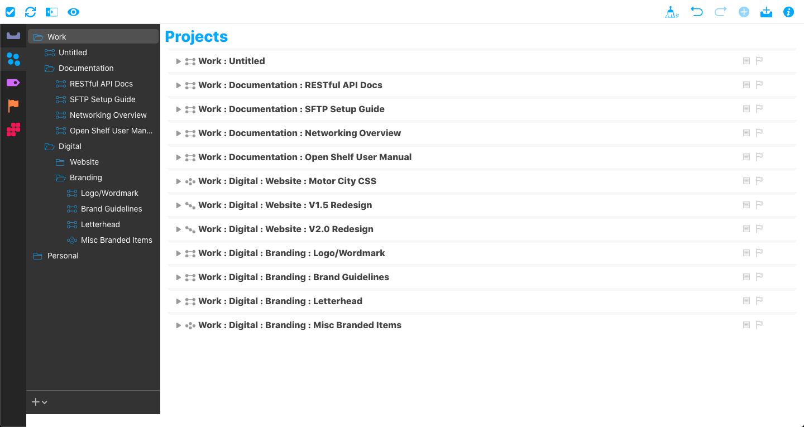
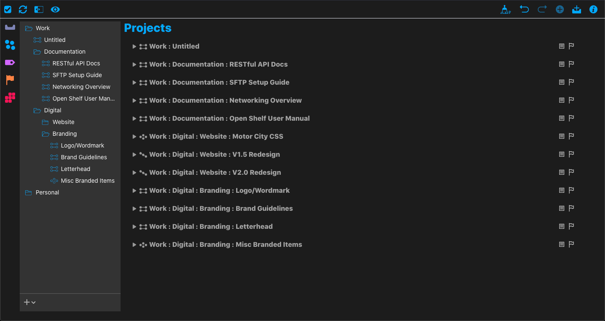
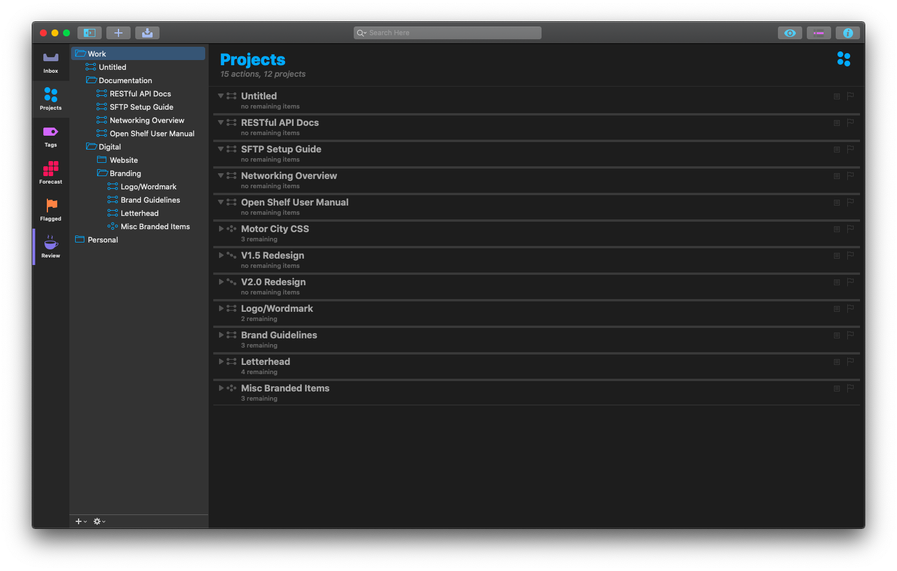

# Dark Mode for OmniFocus3 Web
   

Stylebot CSS file to enable Dark Mode on [OmniFocus3](https://www.omnigroup.com/omnifocus/) web to match the Dark Mode on their macOS desktop app. While Dark Mode was a great addition to the desktop and mobile apps, the web app is stuck with a hybrid theme of Dark Mode sidebar and Light Mode body.

These settings change the web-app to look like the desktop app for uniformity.

## Prerequisites
Before you continue, ensure you have met the following requirements:

* You have the [OmniFocus3](https://www.omnigroup.com/omnifocus/) subscription or have purchased the Web Add-on.
* You are using the [Chrome Browser](https://www.google.com/chrome/).
* You have the [Stylebot Chrome extension](https://chrome.google.com/webstore/detail/stylebot/oiaejidbmkiecgbjeifoejpgmdaleoha?hl=en) installed.

## Installation

1. Click on the Stylebot extension icon in your Chrome browser.
2. Click on "Options"
3. Click on "Styles"
4. Click on "Add a new style..."
5. Enter `web.omnifocus.com` into the URL field.
6. Copy and paste contents of `css/omniFocus.css` into the body of
7. Click "Save"

## Contributing
If you see any issues with any of the style changes I've made, feel free to submit a PR.

1. Fork this repository.
2. Create a branch: `git checkout -b <branch_name>`.
3. Make your changes and commit them: `git commit -m '<commit_message>'`
4. Push to the original branch: `git push origin <project_name>/<location>`
5. Create the pull request.

Alternatively see the GitHub documentation on [creating a pull request](https://help.github.com/en/github/collaborating-with-issues-and-pull-requests/creating-a-pull-request).

## Screenshots

Original Light Mode Web

Updated Dark Mode Web

Dark Mode Desktop

